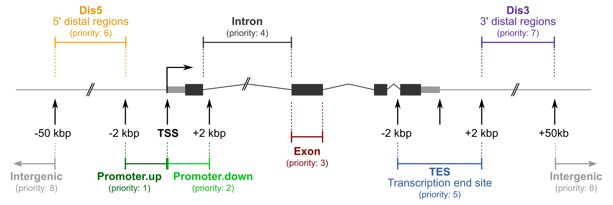
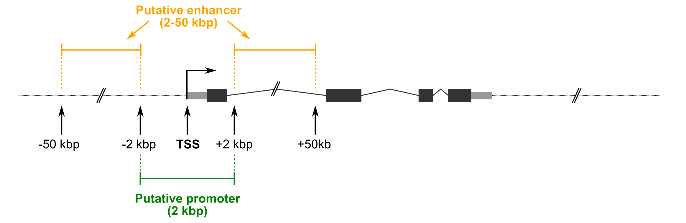

<p align="center">
  
</p>

# Genomic Regions Annotation Pipeline — Agent Skill

Portable skill package for annotation and interpretation of genomic regions from epigenetic NGS datasets including ATAC-seq, ChIP-seq, CUT&Tag, CUT&RUN, and differential region analyses. The workflow performs nearby-gene annotation, genomic feature assignment, reporting, visualization, and GSEA-ready export generation. Agent instructions live in [SKILL.md](SKILL.md).

---

## Environment

### Python

- Python 3.10 or newer

### External tools

- bedtools
- bash
- Standard Unix command-line utilities

### Conda environment

A default environment specification is bundled:

```text
environment/epi_anno_env.yml
```

Create the environment:

```bash
conda env create -f environment/epi_anno_env.yml
conda activate epi_anno_env
```

Or allow the wrapper to create it automatically:

```bash
python run_genomic_regions_annotation.py \
  --input-dir peaks \
  --genome hg38 \
  --create-conda-env \
  --run
```

---

## Install in Cursor / Agent Clients

- Copy or symlink this skill directory into your agent skill path.
- Ensure `scripts/`, `annotations/`, and `environment/` are preserved.
- Invoke by name or ask the agent to run genomic region annotation as described in [SKILL.md](SKILL.md).

---

## Quick Start — BED Files

```bash
python run_genomic_regions_annotation.py \
  --input-dir peaks \
  --genome hg38 \
  --run
```

The wrapper automatically detects:

```text
*.bed    → bed6i0 by default for header-free BED files
*.bed.gz → decompressed to .bed, then bed6i0 by default
```

Use `--bed-has-header` only when BED inputs contain one header line.

and performs:

```text
BED
 ↓
voom2anno.sh
 ↓
annotateGenomicFeatures.py
 ↓
OrganizeAnnotationResults.py
```

---

## Quick Start — Differential Peak Files

```bash
python run_genomic_regions_annotation.py \
  --input-dir differential_results \
  --genome hg19 \
  --run
```

The wrapper automatically detects:

```text
*.vout → pktesth1
```

---

## Dry Run

Validate all inputs, scripts, annotations, helper utilities, and conda configuration without executing:

```bash
python run_genomic_regions_annotation.py \
  --input-dir peaks \
  --genome hg38 \
  --dry-run
```

---

## Run Layout and Metadata

Results are written into a run-specific directory. The wrapper appends a UTC
timestamp suffix to the final component of `--out-dir` using
`YYYYMMDDTHHMMSSZ` format:

```text
<out-dir>-YYYYMMDDTHHMMSSZ/
├── finalReports/
├── allOtherFiles/
├── bedFileAnnotations/
└── GenomicFeaturesAnnotation/
```

Generated outputs include:

- Annotated region tables
- Excel workbooks
- BED exports
- GMT files
- RNK files
- MA plots
- Volcano plots
- PCA plots
- Heatmaps
- Genomic feature summaries

---

## Directory Layout

```text
project/
├── run_genomic_regions_annotation.py
│
├── scripts/
│   ├── voom2anno.sh
│   ├── annotateGenomicFeatures.py
│   ├── OrganizeAnnotationResults.py
│   ├── wcn.sh
│   ├── tabit.sh
│   ├── tabnNA.sh
│   ├── region2bed.sh
│   ├── bed2region.sh
│   ├── winandgroup.sh
│   └── gene2nomicro.awk
│
├── annotations/
│   ├── gencode.v31.hg38.gtf.bed.sorted.tss
│   ├── gencode.v19.hg19.bed.tss
│   ├── gencode.vM22.mm10.gtf.bed.tss
│   ├── gencode.vM17.mm9.gtf.bed.tss
│   ├── sacCer3.shiftedBy125.flank375.bed.tss
│   ├── hg38/
│   ├── hg19/
│   ├── mm10/
│   ├── mm9/
│   └── sacCer3/
│
└── environment/
    └── epi_anno_env.yml
```

---

## Supported Genomes

| Genome | Annotation File |
|----------|----------|
| hg38 | gencode.v31.hg38.gtf.bed.sorted.tss |
| hg19 | gencode.v19.hg19.bed.tss |
| mm10 | gencode.vM22.mm10.gtf.bed.tss |
| mm9 | gencode.vM17.mm9.gtf.bed.tss |
| sacCer3 | sacCer3.shiftedBy125.flank375.bed.tss |

Every annotation or dry-run must include `--genome`. The wrapper and lower-level annotation script do not default to `hg38`; ask the user for the genome build when it is missing.

---

## Helper Script Validation

The wrapper validates:

```text
wcn.sh
tabit.sh
tabnNA.sh
region2bed.sh
bed2region.sh
winandgroup.sh
gene2nomicro.awk
```

and automatically prepends:

```text
scripts/
```

to PATH during execution.

---

## Common Examples

### Custom output directory

```bash
python run_genomic_regions_annotation.py \
  --input-dir peaks \
  --genome hg38 \
  --out-dir results \
  --run
```

This writes to a directory such as `results-20260605T153012Z`.

### Use existing conda environment

```bash
python run_genomic_regions_annotation.py \
  --input-dir peaks \
  --genome hg38 \
  --conda-prefix /path/to/env \
  --run
```

### Use custom annotation directory

```bash
python run_genomic_regions_annotation.py \
  --input-dir peaks \
  --genome hg38 \
  --feature-anno-dir /path/to/annotations \
  --run
```

---

## Testing

```bash
python run_genomic_regions_annotation.py \
  --input-dir peaks \
  --genome hg38 \
  --dry-run
```

Verify helper scripts:

```bash
which wcn.sh
which tabit.sh
```

---

## Feature Assignment Versions

Solarized dark             |  Solarized Ocean
:-------------------------:|:-------------------------:
<p float="left">
  
</p>
<p float="left">
  
   
</p>

 


---

## Citation

| Layer | Credit |
|-------|--------|
| Skill package | CAB AI Skills Genomic Regions Annotation Pipeline |
| Gene annotation | voom2anno.sh |
| Feature annotation | annotateGenomicFeatures.py |
| Reporting | OrganizeAnnotationResults.py |
| Workflow orchestration | run_genomic_regions_annotation.py |

---

## User-facing prompt examples

Example prompts a user might type and how the agent should interpret them.

| User prompt | Interpretation |
|---|---|
| "Run genomic region annotation on `peaks/` for hg38 BED files." | Use `--input-dir peaks --genome hg38`; dry-run first unless the user asks to execute immediately. |
| "Annotate my header-free BED files in `peaks/` using hg38." | Use default BED handling; do not add `--bed-has-header`. |
| "Annotate gzipped BED files in `peaks/` for mm10." | Use default `--bed-glob '*.bed,*.bed.gz'`; `.bed.gz` files are decompressed into the output directory before annotation. |
| "Annotate differential ATAC results in `differential_results/` with hg19." | Use `.vout` auto-detection with `--genome hg19`. |
| "Use `/path/to/env` and annotate `peaks/` for mm10." | Add `--conda-prefix /path/to/env --input-dir peaks --genome mm10`. |
| "Check whether the pipeline is ready for my peak files." | Ask for the genome if missing; then run a dry-run with explicit `--genome`. |
| "Run genomic region annotation on `peaks/`." | Do not run yet; ask which genome build to use. |
| "Build a new deterministic production workflow for repeated paid API calls." | Out of scope for this skill; prefer a workflow with approvals and checkpoints. |

---

## License

This skill package is licensed under Creative Commons Attribution-NonCommercial-ShareAlike 4.0 International (`CC-BY-NC-SA-4.0`). Follow the licenses and notices included with bundled upstream scripts and annotation resources.
